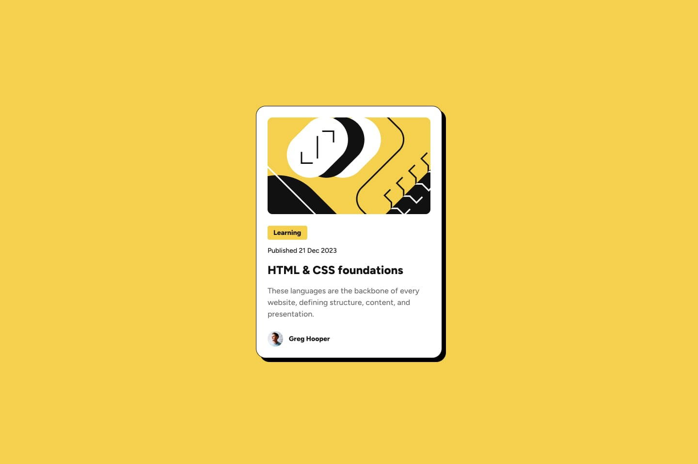

# Frontend Mentor - Blog preview card solution

This is a solution to the [Blog preview card challenge on Frontend Mentor](https://www.frontendmentor.io/challenges/blog-preview-card-ckPaj01IcS). The goal is to make the solution look as close as possible to the given design.

## Table of contents

- [Overview](#overview)
  - [The challenge](#the-challenge)
  - [Screenshot](#screenshot)
  - [Links](#links)
- [My process](#my-process)
  - [Built with](#built-with)
  - [Continued development](#continued-development)
- [Author](#author)

## Overview

### The challenge

Users should be able to:

- See hover and focus states for all interactive elements on the page

### Screenshot

Expected Output

My Solution

### Links

- Solution URL: [Add solution URL here](https://your-solution-url.com)
- Live Site URL: [Add live site URL here](https://your-live-site-url.com)

## My process

### Built with

- Semantic HTML5 markup
- Flexbox
- Mobile-first workflow

### Continued development

Though I'm satisfied with the solution, there could be improvements on removing the redundant CSS styles and refined syntax structure. I was able to manage to make the site responsive over multiple screens by using multiple breakpoints but it could be handled in a more mature way I think. I would be certainly improving these things in future projects.

## Author

- Website - [Add your name here](https://www.your-site.com)
- Frontend Mentor - [@Gokul221](https://www.frontendmentor.io/profile/Gokul221)
- LinkedIn - [Gokul Bhoi](https://www.linkedin.com/in/gokul-bhoi-3b8b39188)
